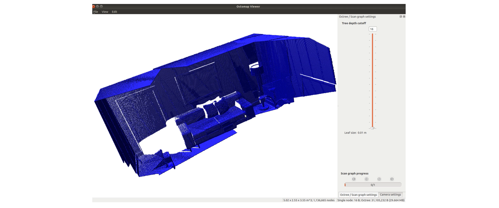

# Nearest Neighbors: Binary Search Tree, Kd-tree, Octree # 

There are mainly three parts in this chapter:
- Nearest Neighbor (NN) Search Problem 
- **Binary Search Tree**
- **Kd-tree (K-dimensional tree)**
- **Octree**

## Nearest Neighbor (NN) Problem 
- K-NN Search 
- Fixed Radius-NN Search 

## Binary Search Tree (BST) 
- Basic knowledge about trees 
- 1D NN problem 
- BST is a node-based tree data structure: left child, right child, and key 

## Kd-tree (K-dimensional tree) 
- Works for data of any dimension 
- It is an extension of BST into high dimension 
- Kd-tree is a binary tree where every leaf node is a k-dimensional point 

## Octree 
- Specifically designed for 3D data (less memory) 
- Each node has 8 children 
- Octree is more efficient because we can stop without going back to root 

    - e.g. this is a 3D octree-based map of [ICL NUIM dataset](https://www.doc.ic.ac.uk/~ahanda/VaFRIC/iclnuim.html)

